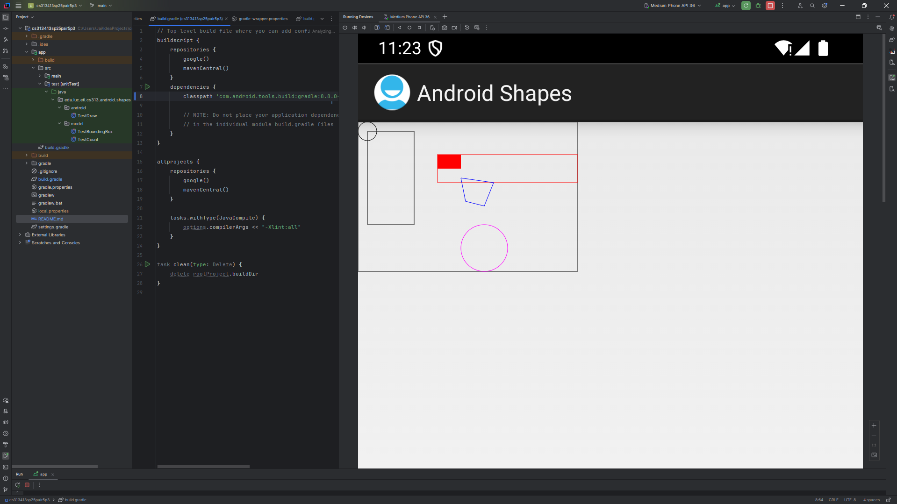

# Jai Fischer and Kaia Karu
Got the tests working on IntelliJ. We tried to get the app working on IntelliJ as well but it did not work. We got it working on android studio. We worked on getting the app to work on IntelliJ and it now works

### Screenshot of the app

### Screenshots of Unit Tests
* Test Count

* Test Bounding Box

* Test Draw

# Learning Objectives

* Familiarity with a simple graphical (output-only) Android project
* Basic design patterns and their purpose
    * Composite pattern
    * Decorator pattern
    * Visitor pattern

# Reading/Listening

* SE Radio episode 1
* APPP chapters 31 and 35

# Setting up the Environment

Check out the project using IntelliJ IDEA. This creates the `local.properties` file
with the required line

    sdk.dir=<root folder of Android Studio's Android SDK installation>

# Running the Application

In IntelliJ: `Run > Run app`

# Running the Tests

## Unit tests (there are no Android tests for shapes)

In IntelliJ's Android view:

* right-click on `app/java/edu...shapes (test)`, then choose `Run Tests in edu...`

You can also use Gradle in a Terminal window:

    $ ./gradlew testDebug # on all platforms

You can view the resulting test reports in HTML by opening this file in your browser:

    app/build/reports/tests/debug/index.html

(So far, this example does not include any Android instrumentation tests.)
